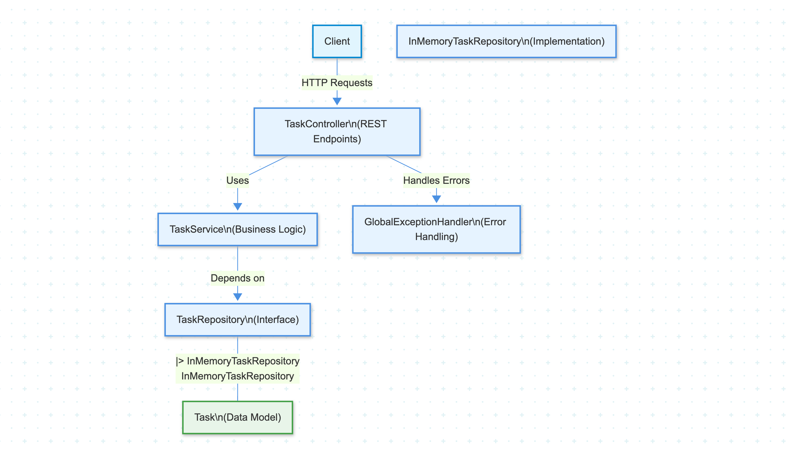

# Task Management API

A RESTful API for managing tasks built with Spring Boot and containerized with Docker.

## Overview

This project implements a Task Management API that allows users to create, read, update, and delete tasks. It demonstrates the use of:

- Spring Framework's Inversion of Control (IoC) container
- Dependency Injection (DI) principles
- Spring Boot for rapid application development
- Spring MVC for building RESTful APIs
- Docker for containerization

## Component Diagram

<!-- Place your component diagram image or Mermaid code below -->



<!-- Or use Mermaid syntax:
```mermaid
<PASTE YOUR MERMAID DIAGRAM CODE HERE>
```
-->

## Features

- CRUD operations for tasks
- Exception handling
- RESTful API design
- Docker containerization

## Prerequisites

- Java 24 or later
- Maven 3.6 or later
- Docker and Docker Compose (for containerization)

## Project Structure

The project follows a clean architecture with the following components:

- **Model**: Represents the data structure
- **Repository**: Handles data access (using an in-memory collection)
- **Service**: Contains business logic
- **Controller**: Exposes REST endpoints
- **Exception**: Handles error cases

## API Endpoints

| HTTP Method | Endpoint         | Description                   |
|-------------|------------------|-------------------------------|
| GET         | /api/tasks       | Get all tasks                 |
| GET         | /api/tasks/{id}  | Get a task by ID              |
| POST        | /api/tasks       | Create a new task             |
| PUT         | /api/tasks/{id}  | Update an existing task       |
| DELETE      | /api/tasks/{id}  | Delete a task                 |

## Running the Application

### Using Maven

```bash
# Clone the repository
git clone <repository-url>
cd Task_Manager

# Build and run the application
./mvnw spring-boot:run
```

### Using Docker

```bash
# Clone the repository
git clone <repository-url>
cd Task_Manager

# Build the Docker image
docker build -t task-manager .

# Run the container
docker run -p 8080:8080 task-manager
```

## API Usage Examples

### Create a Task

```bash
curl -X POST http://localhost:8080/api/tasks \
  -H "Content-Type: application/json" \
  -d '{
    "title": "Complete Spring Boot Lab",
    "description": "Implement a Task Management API using Spring Boot",
    "status": "TODO",
    "dueDate": "2025-06-10T12:00:00"
  }'
```

### Get All Tasks

```bash
curl -X GET http://localhost:8080/api/tasks
```

### Get Task by ID

```bash
curl -X GET http://localhost:8080/api/tasks/1
```

### Update a Task

```bash
curl -X PUT http://localhost:8080/api/tasks/1 \
  -H "Content-Type: application/json" \
  -d '{
    "title": "Complete Spring Boot Lab",
    "description": "Implement a Task Management API using Spring Boot",
    "status": "IN_PROGRESS"
  }'
```

### Delete a Task

```bash
curl -X DELETE http://localhost:8080/api/tasks/1
```

## Task Model

A task has the following properties:

- `id`: Unique identifier (Long)
- `title`: Task title (String)
- `description`: Task description (String)
- `status`: Task status (Enum: TODO, IN_PROGRESS, COMPLETED)
- `createdAt`: Creation timestamp (LocalDateTime)
- `updatedAt`: Last update timestamp (LocalDateTime)
- `dueDate`: Due date (LocalDateTime)
